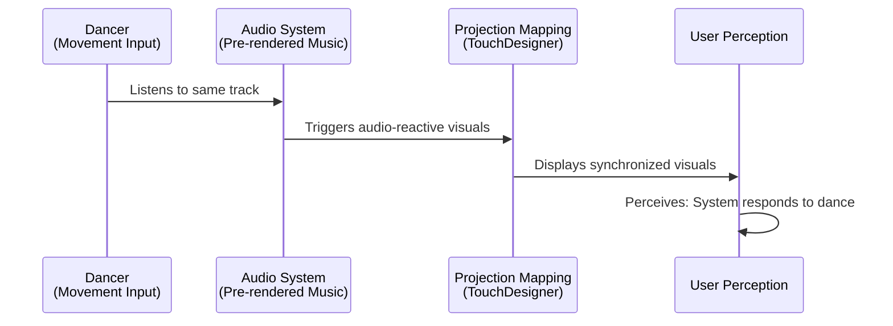
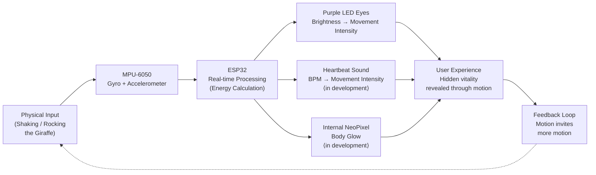

# Interaction Protocol Diagrams

## 1. Gaksi Dokkaebi - Interaction Flow

### Description
- **Dancer**: Moves to the music (listens to audio)
- **Audio System**: Pre-rendered, music-driven (not responsive to movement)
- **Projection Mapping**: TouchDesigner generates audio-reactive visuals
- **User Perception**: Dancer perceives synchronization with the system
- **Reality**: Both dancer and projection respond to the SAME audio source
- **Illusion**: Dancer believes the system is responding to their movement
- **Mechanism**: Complicity through simultaneous alignment, not actual interaction

---

## 2. Kirin - System Protocol

### Description
- **Physical Input**: User shakes or sways the giraffe figure
- **MPU-6050**: Measures gyroscopic velocity and acceleration; computes real-time "energy" value (0.0–1.0)
- **ESP32**: Processes sensor data directly on-device — no external computer required
- **Purple LED Eyes**: Brightness scales with movement intensity; off when still, bright when agitated
- **Heartbeat Sound** *(in development)*: BPM increases with movement (50 BPM at rest → 140 BPM at peak); output via small speaker
- **Internal NeoPixel Glow** *(in development)*: WS2812B ring inside the body radiates through perforations in the shell
- **User Experience**: The giraffe's hidden life force is made visible and audible only through interaction
- **Feedback Loop**: The more the user engages, the more life the object reveals
- **Mechanism**: Stillness = dormancy; motion = emergence of vitality

---

## How to Use These Diagrams

### Option 1: Render in Markdown Preview
Many markdown viewers (GitHub, VS Code, Notion) render Mermaid diagrams directly.

### Option 2: Figma
1. Go to [mermaid.live](https://mermaid.live)
2. Paste the diagram code
3. Export as SVG
4. Import SVG into Figma

### Option 3: Other Tools
- **Draw.io**: Supports Mermaid import
- **Obsidian**: Renders Mermaid natively
- **Confluence**: Built-in Mermaid support

---

## Key Conceptual Differences

| Aspect | Gaksi Dokkaebi | Kirin |
|--------|----------------|-------|
| **Primary Medium** | Visual (Projection Mapping) | Sound + Light + Object |
| **User Input** | Intentional (Dance) | Physical (Shaking) |
| **System Response** | Pre-determined (Audio-reactive) | Real-time (Sensor-driven, on-device) |
| **Illusion** | Synchronization that never existed | Dormant life awakened by touch |
| **Complicity** | Dancer participates in self-deception | User becomes the life source of the object |
| **Design Mechanism** | Invisible alignment | Stillness as absence; motion as presence |
