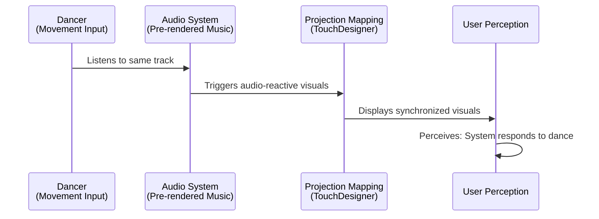
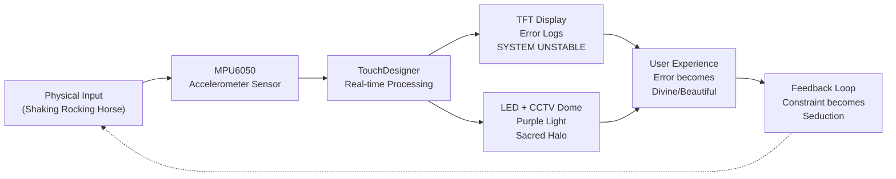

# Interaction Protocol Diagrams

## 1. Gaksi Dokkaebi - Interaction Flow

### Description
- **Dancer**: Moves to the music (listens to audio)
- **Audio System**: Pre-rendered, music-driven (not responsive to movement)
- **Projection Mapping**: TouchDesigner generates audio-reactive visuals
- **User Perception**: Dancer perceives synchronization with the system
- **Reality**: Both dancer and projection respond to the SAME audio source
- **Illusion**: Dancer believes the system is responding to their movement
- **Mechanism**: Complicity through simultaneous alignment, not actual interaction

---

## 2. Kirin - System Protocol

### Description
- **Physical Input**: User shakes/rocks the toy rocking horse
- **MPU6050 Sensor**: Measures acceleration and motion intensity
- **TouchDesigner Processing**: Translates sensor data into visual/audio output in real-time
- **TFT Display Output**: Shows error logs (SYSTEM: UNSTABLE) indicating system malfunction
- **LED + CCTV Dome Output**: Purple LEDs create a sacred, mystical atmosphere through the CCTV dome lens acting as a halo
- **User Experience**: Error and instability become perceived as divine/sacred rather than broken
- **Feedback Loop**: The beautiful constraint (error as sacred) encourages continued interaction
- **Mechanism**: Malfunction becomes seduction; instability becomes transcendence

---

## How to Use These Diagrams

### Option 1: Render in Markdown Preview
Many markdown viewers (GitHub, VS Code, Notion) render Mermaid diagrams directly.

### Option 2: Figma
1. Go to [mermaid.live](https://mermaid.live)
2. Paste the diagram code
3. Export as SVG
4. Import SVG into Figma

### Option 3: Other Tools
- **Draw.io**: Supports Mermaid import
- **Obsidian**: Renders Mermaid natively
- **Confluence**: Built-in Mermaid support

---

## Key Conceptual Differences

| Aspect | Gaksi Dokkaebi | Kirin |
|--------|----------------|-------|
| **Primary Medium** | Visual (Projection Mapping) | Kinetic + Visual + Sensory |
| **User Input** | Intentional (Dance) | Physical (Shaking) |
| **System Response** | Pre-determined (Audio-reactive) | Real-time (Sensor-driven) |
| **Illusion** | Synchronization that never existed | Error as sacred phenomenon |
| **Complicity** | Dancer participates in self-deception | User seeks deeper interaction in malfunction |
| **Design Mechanism** | Invisible alignment | Visible failure becomes beautiful |
